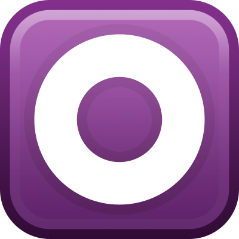

<h1>Simple, Powerful, Flexible 
OpenGL Visual Stimuli in MATLAB&reg;</h1>

  <a href="{{ site.github.repo }}/releases/download/{{ site.version }}/Stage.mltbx" class="btn">Download</a>
  <a href="{{ site.github.repo }}" class="btn">GitHub</a>

## What is Stage?
Stage is a MATLAB based visual stimulus system for vision research. It provides a toolbox for writing visual stimulus routines.

## Free and Open Source
Stage is released under the [MIT License](https://opensource.org/licenses/MIT), which is an [open source license](https://opensource.org/docs/osd). You can share and change the source code to your heart's content!

&copy; {{ site.time | date: '%Y' }} Stage-VSS. MATLAB is a registered trademark of The MathWorks, Inc. The OSI logo trademark is the trademark of Open Source Initiative.
