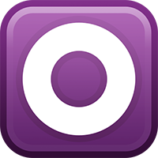
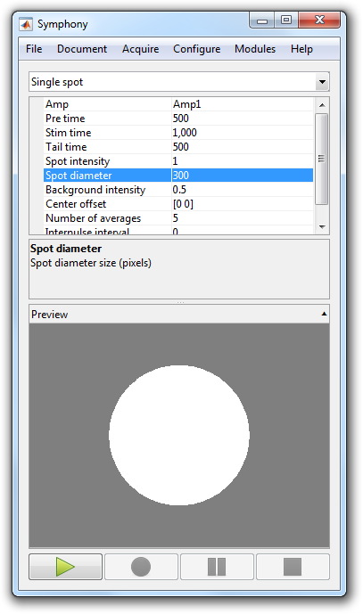
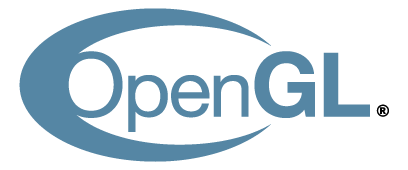

<h1>Simple, Powerful, Flexible 
OpenGL Visual Stimuli in MATLAB&reg;</h1>

<a href="{{ site.github.repo }}/releases/download/{{ site.version }}/Stage.mltbx" class="btn">Download</a>
<a href="{{ site.github.repo }}" class="btn">GitHub</a>

## What is Stage?
Stage is a MATLAB based visual stimulus system for vision research. It provides a toolbox for writing visual stimulus routines.

## Built-in Stimuli
Stage comes with a wide variety of built-in stimuli. You can layer stimuli and animate their attributes (position, size, orientation, color, opacity, etc.) to create complex presentations.

  
  

    <h3>{{ stimulus.title }}</h3>

    

    
<label class="btn collapse-toggle">View Code</label>

    

      
    

  

  

## Masks and Filters
Stage supports real-time transparency masks and convolution filters. The use of shaders enable all effects processing to occur on the GPU.

  
  

    <h3>{{ effect.title }}</h3>

    

    
<label class="btn collapse-toggle">View Code</label>

    

      
    

  

  

## Stage Server
Stage includes a Stage Server app to enable remote stimulus presentation across MATLAB sessions. The sessions may be running on the same machine or on separate machines across a network.

## Symphony Integration
Stage integrates seamlessly with [Symphony](http://symphony-das.github.io). You can create and display Stage presentations directly in your Symphony protocols.

<label class="btn collapse-toggle">View an Example Protocol</label>

  

## Built for Modern OpenGL
Stage was built for core OpenGL 3.2+ which enables it to be more efficient, flexible, and future-proof. The toolbox makes extensive use of vertex buffer and array objects as well as shaders.

## Free and Open Source
Stage is released under the [MIT License](https://opensource.org/licenses/MIT), which is an [open source license](https://opensource.org/docs/osd). You can share and change the source code to your heart's content!

&copy; {{ site.time | date: '%Y' }} Stage-VSS. MATLAB is a registered trademark of The MathWorks, Inc. OpenGL and the oval logo are trademarks or registered trademarks of Silicon Graphics, Inc. in the United States and/or other countries worldwide. The OSI logo trademark is the trademark of Open Source Initiative.
